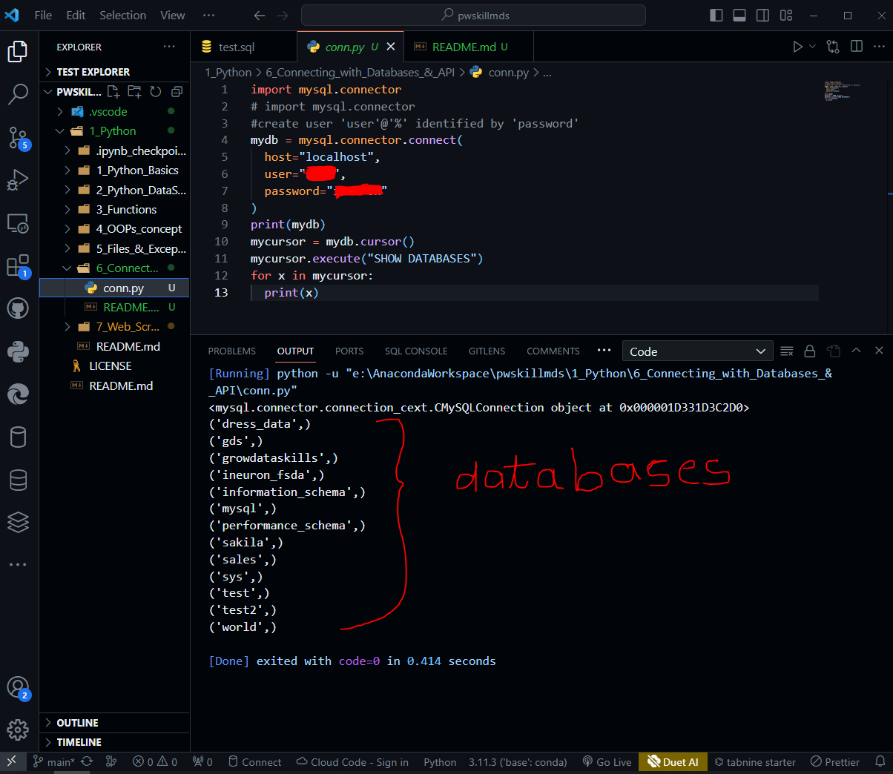
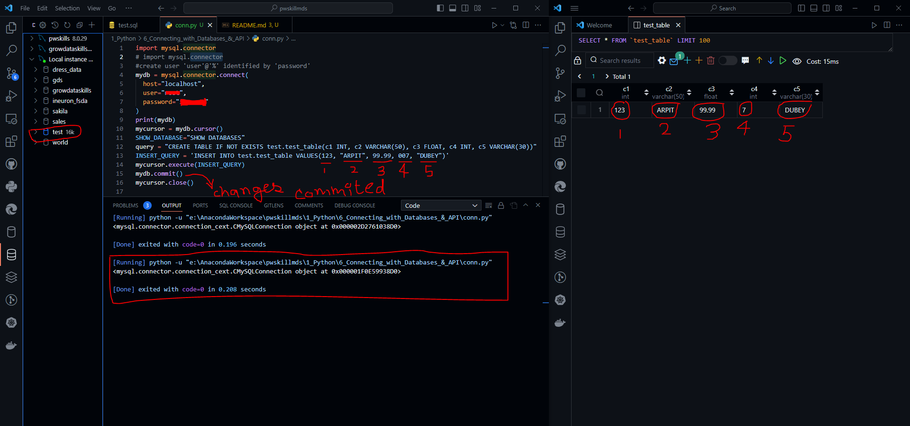
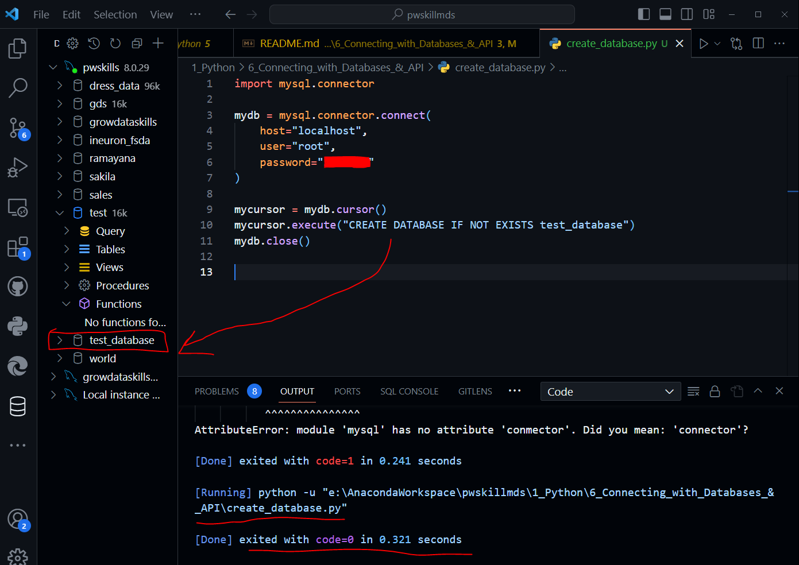
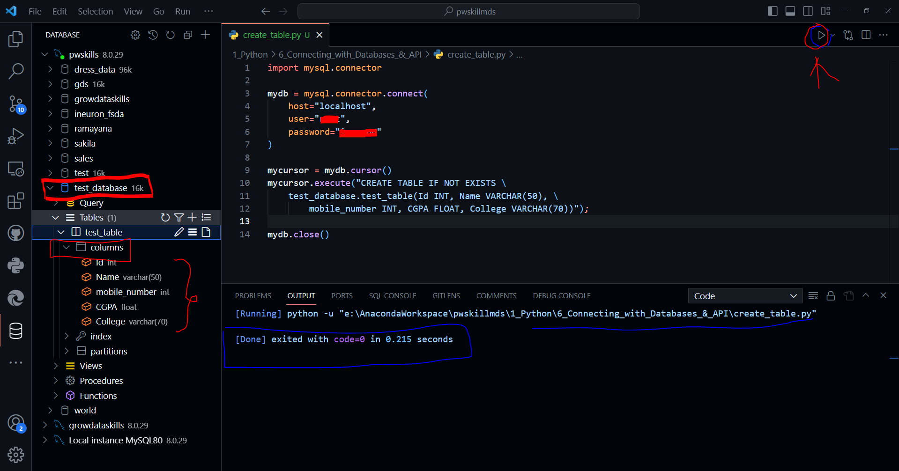
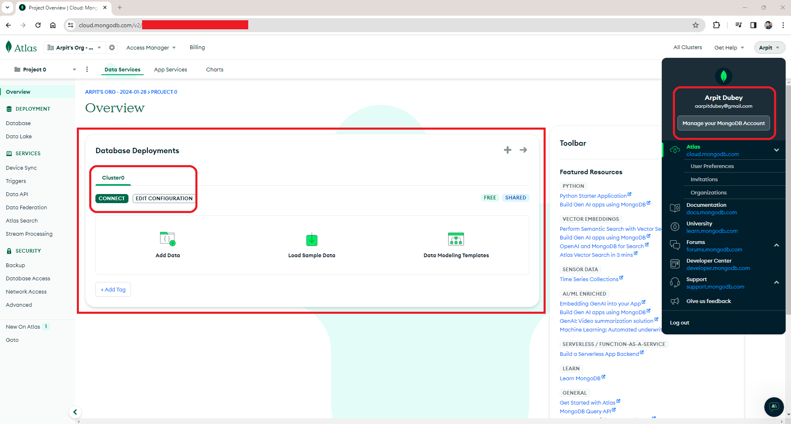

```python
import mysql.connector
# import mysql.connector
#create user 'user'@'%' identified by 'password'
mydb = mysql.connector.connect(
  host="localhost",
  user="<USERNAME>",
  password="<PASSWORD>"
)
print(mydb)
mycursor = mydb.cursor()
mycursor.execute("SHOW DATABASES")
for x in mycursor:
  print(x)
```

```SQL
SHOW DATABASES
```


```python

import mysql.connector
# import mysql.connector
#create user 'user'@'%' identified by 'password'
mydb = mysql.connector.connect(
  host="localhost",
  user="<USERNAME>",
  password="<PASSWORD>"
)
print(mydb)
mycursor = mydb.cursor()
INSERT_QUERY = 'INSERT INTO test.test_table VALUES(123, "ARPIT", 99.99, 007, "DUBEY")'
mycursor.execute(INSERT_QUERY)
mydb.commit()
mycursor.close()

```

```SQL
INSERT INTO test.test_table VALUES(123, "ARPIT", 99.99, 007, "DUBEY");
```



```python

import mysql.connector

mydb = mysql.connector.connect(
    host="localhost",
    user="*****",
    password="******"
)

mycursor = mydb.cursor()
mycursor.execute("CREATE DATABASE IF NOT EXISTS test_database")
mydb.close()

```

```SQl
CREATE DATABASE IF NOT EXISTS test_database;
```

  


```python

import mysql.connector

mydb = mysql.connector.connect(
    host="localhost",
    user="********",
    password="******"
)

mycursor = mydb.cursor()
mycursor.execute("CREATE TABLE IF NOT EXISTS \
    test_database.test_table(Id INT, Name VARCHAR(50), \
        mobile_number INT, CGPA FLOAT, College VARCHAR(70))");

mydb.close()

```

```SQL
CREATE TABLE IF NOT EXISTS test_database.test_table(Id INT, Name VARCHAR(50), mobile_number INT, CGPA FLOAT, College VARCHAR(70));
```



# MongoDB

### 1. Connection to MondoDB cloud Atlas Server



